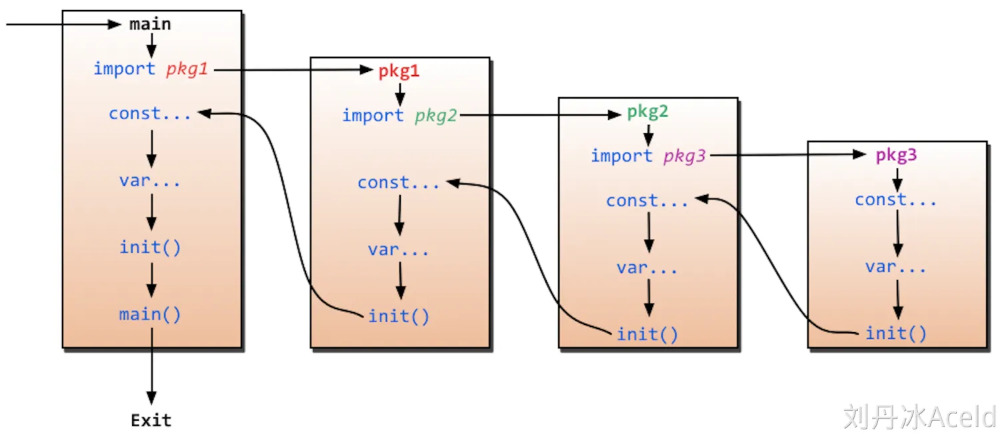

# 8小时go学习笔记

## 语言特性
 - 极简部署
   - 可直接编译为机器码
   - 不依赖其他库
   - 直接运行部署
 - 静态类型语言
   - 编译可检查出大多数问题
 - 天生并发支持
   - 天生基因
   - 充分利用多核
 - 强大的标准库
   - runtime系统调度机制
   - 高效GC垃圾回收
   - 丰富的标准库
 - 简单易学
   - 25个关键字
   - C语言简洁基因，内嵌C语法支持
   - 面向对象特征（封装、继承、多态）
   - 跨平台
 - 大厂领军

## 适合领域
 - 云计算基础设施领域
   - 代表项目：docker、kubernetes、etcd、consul、cloudflare CDN、七牛云存储等。
 - 基础后端软件
   - 代表项目：tidb、influxdb、cockroachdb等。
 - 微服务
   - 代表项目：go-kit、micro、monzo bank的typhon、bilibili等。
 - 互联网基础设施
   - 代表项目：以太坊、hyperledger等。

## 语法
### 编译
```go
  package main


  import "fmt"


  func main() {
          /* 简单的程序 万能的hello world */
          fmt.Println("Hello Go")
  }
```
``` 
$go build test1_hello.go 
$./test1_hello
Hello Go
```
### 变量的声明
```
1. var v_name [v_type] [= value]
2. v_name := value  // 注意 :=左侧的变量不应该是已经声明过的，否则会导致编译错误。
3. var v_name1,v_name2 [v_type] [= value1, value2]
4. v_name1,v_name2 := 1,2   // 这种不带声明格式的只能在函数体内声明
5. var (    // 这种分解的写法,一般用于声明全局变量
        a int
        b bool
    )
```
```
var a int = 10
var b = 10
c : = 10

var x, y int
var ( //这种分解的写法,一般用于声明全局变量
        a int
        b bool
)


var c1, d int = 1, 2
var e, f = 123, "liudanbing"


//这种不带声明格式的只能在函数体内声明
//g, h := 123, "需要在func函数体内实现"


func main() {
        g, h := 123, "需要在func函数体内实现"
        fmt.Println(x, y, a, b, c, d, e, f, g, h)


        //不能对g变量再次做初始化声明
        //g := 400


        _, value := 7, 5  //实际上7的赋值被废弃，变量 _  不具备读特性
        //fmt.Println(_) //_变量的是读不出来的
        fmt.Println(value) //5
}

```
    
### 常量
#### 格式
```
const identifier [type] = value
```
```
const (
    Unknown = 0
    Female = 1
    Male = 2
)
```

#### iota 自增长
    在下一行增长，而不是立即取得它的引用
```
const (
    CategoryBooks = iota // 0
    CategoryHealth       // 1
    CategoryClothing     // 2
)
```
```
type Allergen int


const (
    IgEggs Allergen = 1 << iota         // 1 << 0 which is 00000001 ==> 1
    IgChocolate                         // 1 << 1 which is 00000010 ==> 2
    IgNuts                              // 1 << 2 which is 00000100 ==> 4
    IgStrawberries                      // 1 << 3 which is 00001000 ==> 8
    IgShellfish                         // 1 << 4 which is 00010000 ==> 16
)
```

### 函数

在go中，函数名称首字母大写是公有方法，首字母小写是私有方法。

#### 返回多个值
```
func method_name(key1, key2) (return1_type, return2_type) {
    return key1, key2
}
```

```go
package main


import "fmt"


func swap(x, y string) (string, string) {
   return y, x
}


func main() {
   a, b := swap("Mahesh", "Kumar")
   fmt.Println(a, b)
}
```

    

#### main()、init() 和import
 - main 函数只能在package main中。
 - init 函数可在package main中，可在其他package中，可在同一个package中出现多次。
 - 这两个函数在定义时不能有任何的参数和返回值。
 - 虽然一个package里面可以写任意多个init函数，但这无论是对于可读性还是以后的可维护性来说，我们都强烈建议用户在一个package中每个文件只写一个init函数。
 - 
##### 执行顺序：
1. 程序的初始化和执行都起始于main包。
2. 如果main包还导入了其它的包，那么就会在编译时将它们依次导入。有时一个包会被多个包同时导入，那么它只会被导入一次（例如很多包可能都会用到fmt包，但它只会被导入一次，因为没有必要导入多次）。
3. 当一个包被导入时，如果该包还导入了其它的包，那么会先将其它包导入进来，然后再对这些包中的包级常量和变量进行初始化，接着执行init函数（如果有的话），依次类推。
4. 等所有被导入的包都加载完毕了，就会开始对main包中的包级常量和变量进行初始化，然后执行main包中的init函数（如果存在的话），最后执行main函数。

###### 例子
Lib1.go
```go
package InitLib1

import (
    "fmt"
    _ "GolangTraining/InitLib2"
)

func init() {
    fmt.Println("lib1")
}
```
Lib2.go
```go
package InitLib2

import "fmt"

func init() {
    fmt.Println("lib2")
}
```
main.go
```go
package main

import (
    "fmt"
    _ "GolangTraining/InitLib1"
    _ "GolangTraining/InitLib2"
)

func init() {
    fmt.Println("libmain init")
}

func main() {
    fmt.Println("libmian main")
}
```
result:
```
lib2
lib1
libmain init
libmian main
```

#### 函数参数
函数如果使用参数，该变量可称为函数的形参。
形参就像定义在函数体内的局部变量。
调用函数，可以通过两种方式来传递参数：
##### 值传递
值传递是指在调用函数时将实际参数复制一份传递到函数中，这样在函数中如果对参数进行修改，将不会影响到实际参数。

默认情况下，Go 语言使用的是值传递，即在调用过程中不会影响到实际参数。
```go
package main

import "fmt"

func main() {
   /* 定义局部变量 */
   var a int = 100
   var b int = 200

   fmt.Printf("交换前 a 的值为 : %d\n", a )
   fmt.Printf("交换前 b 的值为 : %d\n", b )

   /* 通过调用函数来交换值 */
   swap(a, b)

   fmt.Printf("交换后 a 的值 : %d\n", a )
   fmt.Printf("交换后 b 的值 : %d\n", b )
}

/* 定义相互交换值的函数 */
func swap(x, y int) int {
   var temp int

   temp = x /* 保存 x 的值 */
   x = y    /* 将 y 值赋给 x */
   y = temp /* 将 temp 值赋给 y*/

   return temp;
}
```
result:
```
交换前 a 的值为 : 100
交换前 b 的值为 : 200
交换后 a 的值 : 100
交换后 b 的值 : 200
```

##### 引用传递(指针传递)

函数中引用传递*

变量指向地址&

```go
package main


import "fmt"


func main() {
   /* 定义局部变量 */
   var a int = 100
   var b int= 200


   fmt.Printf("交换前，a 的值 : %d\n", a )
   fmt.Printf("交换前，b 的值 : %d\n", b )


   /* 调用 swap() 函数
   * &a 指向 a 指针，a 变量的地址
   * &b 指向 b 指针，b 变量的地址
   */
   swap(&a, &b)


   fmt.Printf("交换后，a 的值 : %d\n", a )
   fmt.Printf("交换后，b 的值 : %d\n", b )
}


func swap(x *int, y *int) {
   var temp int
   temp = *x    /* 保存 x 地址上的值 */
   *x = *y      /* 将 y 值赋给 x */
   *y = temp    /* 将 temp 值赋给 y */
}
```
result:
```
交换前，a 的值 : 100
交换前，b 的值 : 200
交换后，a 的值 : 200
交换后，b 的值 : 100
```

### defer
defer语句会将其后的函数调用推迟到当前函数执行结束时执行。这个特性常用于处理成对的操作，如打开/关闭文件、获取/释放锁、连接/断开连接等，确保资源被适当地释放，即使在发生错误或提前返回的情况下也能保证执行。

如果一个函数中有多个defer语句，它们会以LIFO（后进先出）的顺序执行。


### recover错误拦截
运行时panic异常一旦被引发就会导致程序崩溃。

Go语言提供了专用于“拦截”运行时panic的内建函数“recover”。它可以是当前的程序从运行时panic的状态中恢复并重新获得流程控制权。

注意：recover只有在defer调用的函数中有效。

```go
package main

import "fmt"

func Demo(i int) {
	//定义10个元素的数组
	var arr [10]int
	//错误拦截要在产生错误前设置
	defer func() {
		//设置recover拦截错误信息
		err := recover()
		//产生panic异常  打印错误信息
		if err != nil {
			fmt.Println(err)
		}
	}()
	//根据函数参数为数组元素赋值
	//如果i的值超过数组下标 会报错误：数组下标越界
	arr[i] = 10

}

func main() {
	Demo(10)
	//产生错误后 程序继续
	fmt.Println("程序继续执行...")
}
```
```
runtime error: index out of range [10] with length 10
程序继续执行...
```

### slice和map
#### slice 切片（“动态数组”） 类似于 List
 - 不需要说明长度
##### 定义
```
var identifier []type

// 这里 len 是数组的长度并且也是切片的初始长度。
// capacity（可选）：指定切片的容量，容量大于或等于长度。容量是这个切片在不需要扩容的情况下可以容纳的元素个数。
var slice1 []type = make([]type, len, capacity)
slice1 := make([]type, len, capacity)
```
##### 初始化
```
s :=[] int {1,2,3 }

// 将arr中从下标startIndex到endIndex-1 下的元素创建为一个新的切片
s := arr[startIndex:endIndex]

s :=make([]int,len,cap)
```
##### len() 、 cap() 和 append() 函数
 - len() 获取切片当前存储并能访问的元素数量
 - cap() 获取切片底层数组可以容纳的元素总数
 - append() 当切片中元素超过容量时，Go 会自动扩展切片的容量，底层会创建一个新的数组并拷贝现有的数据到新的数组中。
 - copy() 将源切片的内容复制到目标切片中。这个函数可以高效地进行切片之间的元素拷贝，并返回实际复制的元素个数。
   - 只会复制两者长度较小的部分；
   - 目标切片会被覆盖；
   - 深拷贝：对于基本类型的切片，copy() 函数进行的是值的深拷贝，源切片的变化不会影响目标切片。
```go
package main

import "fmt"

func main() {
    // 创建一个长度为 5，容量为 10 的整型切片
    slice := make([]int, 5, 10)
    
    fmt.Println("初始长度:", len(slice))    // 输出: 5
    fmt.Println("初始容量:", cap(slice))    // 输出: 10
    fmt.Println("初始值:", slice)            // 输出: [0 0 0 0 0]
    
    // 尝试往切片中追加一个新元素
    slice = append(slice, 1)
    fmt.Println("追加后的长度:", len(slice)) // 输出: 6
    fmt.Println("追加后的容量:", cap(slice)) // 输出: 10
    fmt.Println("追加后的值:", slice)        // 输出: [0 0 0 0 0 1]
    
    var numbers []int                   // 此时 numbers是空的 nil len = 0 cap = 0
    if(numbers == nil){
      fmt.Printf("切片是空的")
    }

    slice1 := make([]int, len(slice), cap(slice)*2)
    copy(slice1, slice)
    fmt.Println("copy slice 到slice1后 slice1的值:", slice1)           // 输出:  [0 0 0 0 0 1]
    fmt.Println("copy slice 到slice1后 slice1的长度:", len(slice1))    // 输出:  6
    fmt.Println("copy slice 到slice1后 slice1的容量:", cap(slice1))    // 输出:  20
}

```


#### map
在 Go 语言中，`map` 是一种内置的数据结构，用于存储键值对（key-value pairs）。它有点类似于其他编程语言中的字典或哈希表，允许通过键快速查找对应的值。

##### 定义和使用
`map` 的定义语法是：
```
map[KeyType]ValueType
```
- **KeyType**：键的类型，必须是支持相等比较的类型（如 `int`、`string`、`bool` 等）。
- **ValueType**：值的类型，可以是任意类型。

##### 示例代码
```go
package main

import "fmt"

func main() {
    // 创建一个map，键是字符串，值是整数
    scores := make(map[string]int)

    // 向map中添加键值对
    scores["Alice"] = 90
    scores["Bob"] = 85

    // 通过键访问值
    fmt.Println("Alice的分数:", scores["Alice"])

    // 检查键是否存在
    score, exists := scores["Charlie"]
    if exists {
        fmt.Println("Charlie的分数:", score)
    } else {
        fmt.Println("Charlie不存在")
    }

    // 删除键值对
    delete(scores, "Bob")
}
```

##### 常用操作
1. **创建 `map`**：使用 `make()` 函数创建。
2. **添加或更新元素**：通过 `map[key] = value` 添加或更新键值对。
3. **访问元素**：通过 `map[key]` 获取对应的值。
4. **删除元素**：使用 `delete(map, key)` 删除某个键。
5. **检查键是否存在**：返回两个值，第二个是布尔值，用于判断键是否存在。

##### 小结
- `map` 是一种键值对存储结构，查找速度快。
- 通过 `make()` 创建，支持增删改查操作。


### 面向对象特征
Go 语言并不像传统的面向对象语言那样提供类和继承等机制，但它依然具备面向对象的特征，如**封装**、**多态**、和**组合**，通过结构体（`struct`）和接口（`interface`）实现这些特性。

#### 1. **封装**
Go 使用结构体（`struct`）来封装数据和行为，通过方法绑定结构体实现类似类的功能。访问控制通过标识符首字母大小写控制：
- **大写**：公开成员（可以被包外访问）。
- **小写**：私有成员（仅限包内访问）。

##### 示例：
```go
type Person struct {
    Name string // 公有字段
    age  int    // 私有字段
}

func (p Person) Greet() {
    fmt.Println("Hello, my name is", p.Name)
}
```

#### 2. **多态**
多态通过接口（`interface`）实现。一个类型只要实现了接口中的方法，就被认为实现了该接口，不需要显式声明。

##### 示例：
```go
type Speaker interface {
    Speak()
}

type Person struct {
    Name string
}

func (p Person) Speak() {
    fmt.Println("Hello, I am", p.Name)
}

func main() {
    var s Speaker
    s = Person{Name: "Alice"}
    s.Speak() // 输出: Hello, I am Alice
}
```

#### 3. **组合**
Go 没有继承，而是通过**组合**（嵌套结构体）来复用代码。

##### 示例：
```go
type Animal struct {
    Name string
}

func (a Animal) Move() {
    fmt.Println(a.Name, "is moving")
}

type Dog struct {
    Animal // 组合
}

func main() {
    d := Dog{Animal{Name: "Buddy"}}
    d.Move() // 输出: Buddy is moving
}
```

#### 总结：
- **封装**：通过 `struct` 和方法实现。
- **多态**：通过接口实现。
- **组合**：通过嵌套 `struct` 复用代码。


### 常量
### 常量
### 常量
### 常量
